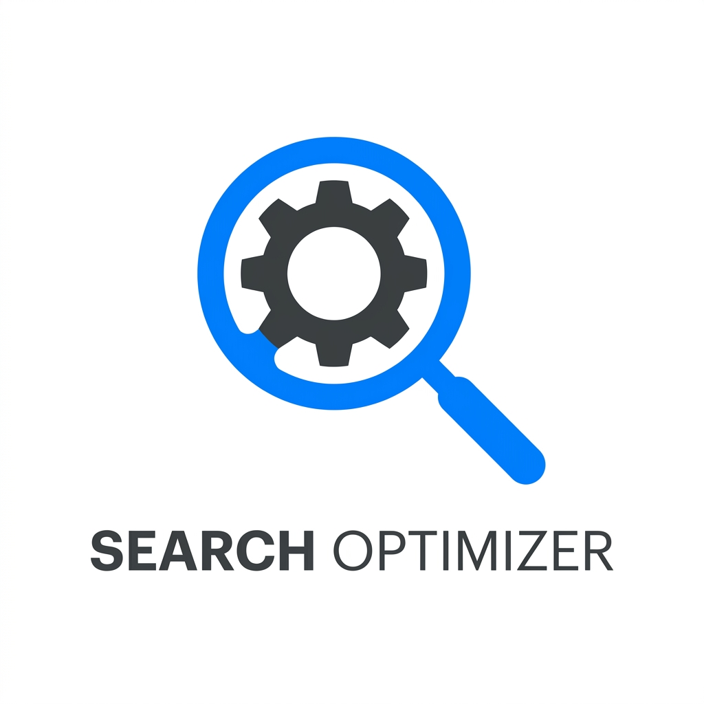
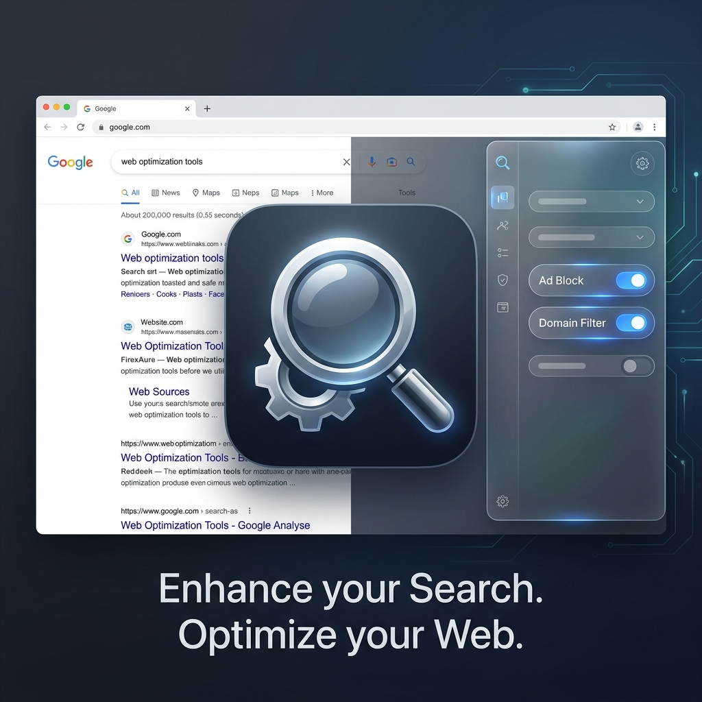

# 🔍 Search Optimizer

**Search Optimizer** is a powerful browser extension designed to declutter your Google Search experience. It gives you full control over what you see, allowing you to block unwanted domains, hide distracting modules, and use advanced search operators with ease.

---

## ✨ Key Features

### 🚫 Domain Blocker & Link Filter
*   **Quick Block:** Block any domain directly from the search results with a single click.
*   **Domain Management:** Manage your blocklist easily through the extension popup.
*   **Preferred Domains:** Highlight results from your favorite websites in green for better visibility.

### 🧹 UI Decluttering (Hide Google Modules)
*   **Ad-Free Experience:** Automatically hides sponsored posts and ads.
*   **Module Control:** Hide distracting "Latest from...", "People also ask", "Videos", "Images", and "Related Searches" blocks.
*   **Tab Cleaner:** Hide specific search tabs (e.g., Shopping, Maps) to keep your navigation clean.

### ⚙️ Advanced Search Operators Panel
*   **Quick Operators:** Add `filetype:`, `site:`, `intitle:`, and date filters without typing complex queries.
*   **PDF Search:** Dedicated shortcuts for finding documents and specific file types.
*   **Search Integration:** Accessible directly via a gear icon next to the search bar.

### 🎮 Google Fun & Games
*   Quick access to hidden Google easter eggs and games like **Minecraft**, **Pac-man**, **Snake**, and more directly from the operators panel.

### 🔄 Infinite Scroll
*   Automatically loads the next page of results as you scroll down, providing a seamless browsing experience.

---

## 🚀 Installation

1.  **Download from the Chrome Web Store:**
    [**👉 Install Search Optimizer**](https://chrome.google.com/webstore) *(Link to be updated once published)*
2.  **Manual Installation (Developer Mode):**
    *   Clone this repository.
    *   Go to `chrome://extensions/` in your browser.
    *   Enable "Developer mode".
    *   Click "Load unpacked" and select the extension folder.

---

## 🎨 Branding Assets

| Logo | Promo Banner |
| :---: | :---: |
|  |  |

---

## 🛠 Technology Stack
*   **Manifest V3** for modern security and performance.
*   **Vanilla JavaScript** for lightweight execution.
*   **CSS3** with a sleek, dark-themed UI.
*   **Chrome Storage API** for settings synchronization.

---

## 🛡 Privacy Policy
Search Optimizer respects your privacy. All your settings (blocked domains, preferences) are stored locally on your device or synced via your Google Account. We **do not** collect, store, or transmit any of your personal data or search history.

---

## 📄 License
This project is licensed under the MIT License - see the [LICENSE](LICENSE) file for details.

---

*Developed with ❤️ to make search better.*
